# Inspirations Design — Project Labor

> Benchmark UI/UX de plateformes accessibles à des professionnels de terrain peu à l'aise avec le numérique.  
> Cible visée : agriculteurs et saisonniers, connexion parfois limitée.

---

## Sommaire

1. [Hellowork — Résultats de recherche mobile](#1-hellowork--résultats-de-recherche-mobile)
2. [Indeed — Fiche offre d'emploi mobile](#2-indeed--fiche-offre-demploi-mobile)
3. [AlloVoisins — Création de demande](#3-allovoisins--création-de-demande)
4. [Habitatpresto — Formulaire guidé par étapes](#4-habitatpresto--formulaire-guidé-par-étapes)
5. [Adecco & Moi — Dashboard mission intérim](#5-adecco--moi--dashboard-mission-intérim)
6. [Welcome to the Jungle — Fiche offre enrichie](#6-welcome-to-the-jungle--fiche-offre-enrichie)
7. [Jobagri — Recherche d'offres spécialisée agricole](#7-jobagri--recherche-doffres-spécialisée-agricole)
8. [ANEFA — Carrousel métiers illustrés](#8-anefa--carrousel-métiers-illustrés)
9. [Jobopré (ANEFA) — Carte géolocalisée](#9-jobopré-anefa--carte-géolocalisée)
10. [L'Agriculture recrute — Accueil national](#10-lagriculture-recrute--accueil-national)
11. [Travaux.com — Formulaire](#11-travauxcom--formulaire)
12. [StarOfService](#12-starofservice)
13. [WiziFarm](#13-wizifarm)
14. [La Ruche qui dit Oui](#14-la-ruche-qui-dit-oui)
15. [Synthèse](#synthèse)

---

## 1. Hellowork — Résultats de recherche mobile

**Type d'écran :** Liste de résultats 

**Lien :** [hellowork.com](https://www.hellowork.com/)

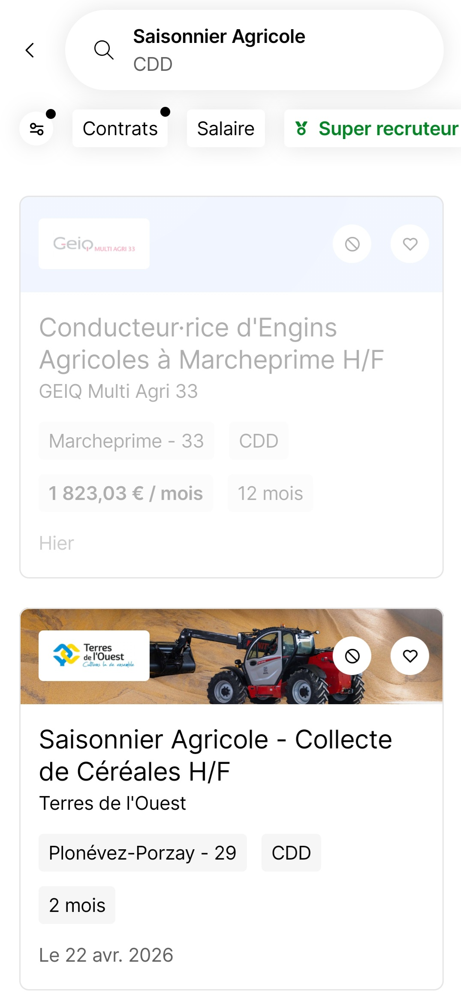

**Ce qui est bien fait :**  
La barre de recherche en haut rappelle en permanence ce qui a été cherché ("Saisonnier Agricole / CDD"). L'utilisateur sait toujours où il en est.  
Les filtres ("Contrats", "Salaire", "Super recruteur") sont sur une seule ligne scrollable, avec des pastilles bleues qui signalent les filtres actifs. Pas besoin de savoir lire un menu — un point coloré suffit.  
Chaque carte montre le logo de l'entreprise, le salaire mensuel en gras, la durée du contrat et la date de publication. Tout ce qu'un saisonnier a besoin de savoir pour décider si ça l'intéresse — sans ouvrir la fiche.  
La deuxième carte utilise une photo de terrain (engin agricole). Ça parle immédiatement à quelqu'un du métier.

---

## 2. Indeed — Fiche offre d'emploi

**Type d'écran :** Détail d'une offre (site responsive)  

**Lien :** [indeed.fr](https://www.indeed.fr/)

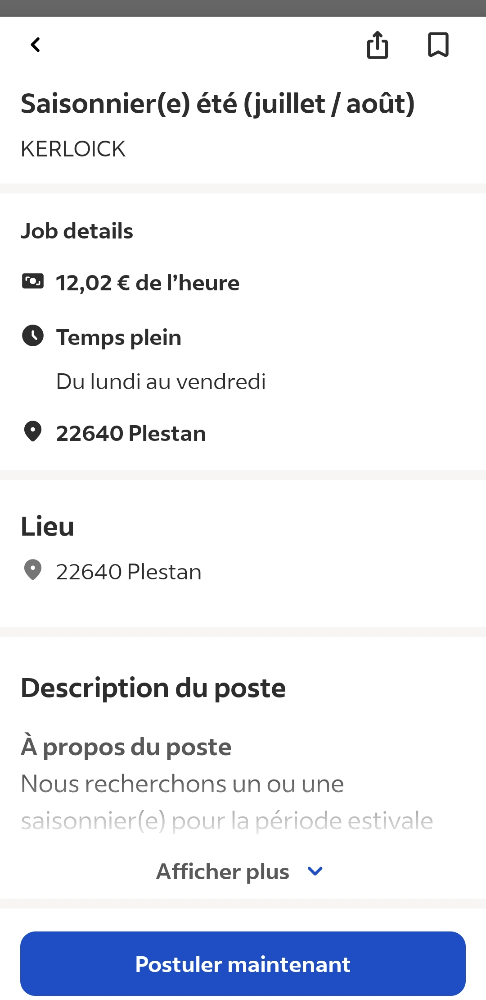

**Ce qui est bien fait :**  
Les 3 infos décisives sont empilées verticalement avec des icônes : salaire (12,02 €/h), horaires (temps plein, lundi au vendredi), lieu (22640 Plestan). Un saisonnier qui consulte en 10 secondes dans son champ a sa réponse sans scroller.  
La description est tronquée avec "Afficher plus" — le texte long ne bloque pas l'accès au bouton d'action.  
"Postuler maintenant" est fixe en bas d'écran, toujours visible. Gros bouton bleu pleine largeur, impossible à rater même avec des doigts sales ou en plein soleil.

---

## 3. AlloVoisins — Création de demande

**Type d'écran :** Modale de publication  

**Lien :** [allovoisins.com](https://www.allovoisins.com/)

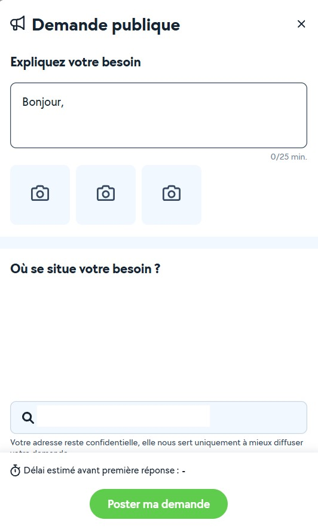

**Ce qui est bien fait :**  
Tout tient sur un seul écran scrollable : texte libre, photos, choix particulier/pro, carte, bouton. Pas de pagination, pas d'étapes — c'est publié en 30 secondes.  
Les questions sont en langage parlé : "De quoi avez-vous besoin ?", "De qui avez-vous besoin ?", "Où se situe votre besoin ?". On dirait une conversation, pas un formulaire administratif.  
Les 3 emplacements photo sont là mais vides — ça incite sans bloquer.  
La carte se remplit automatiquement par géolocalisation. L'utilisateur n'a rien à taper pour indiquer où il est.  
Le "Délai estimé avant première réponse" rassure avant même de publier : quelqu'un va répondre.

---

## 4. Habitatpresto — Formulaire guidé par étapes

**Type d'écran :** Formulaire de demande de devis  

**Lien :** [habitatpresto.com](https://www.habitatpresto.com/)

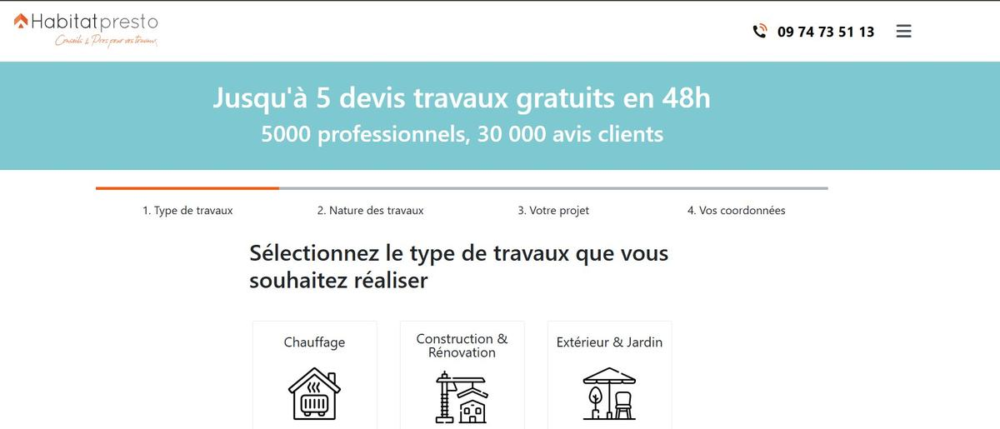

**Ce qui est bien fait :**  
La barre de progression en haut (colorée en orange/gris) montre visuellement "Étape 1 : Type de travaux". L'utilisateur sait combien il reste à faire et ne se sent jamais perdu.  
Les catégories sont présentées avec des grandes icônes illustrées (Chauffage, Plomberie…) — l'utilisateur tape sur une image plutôt que de lire un menu déroulant. Pour quelqu'un qui a l'habitude de reconnaître des outils plutôt que de lire des mots, c'est naturel.  
Le hero affiche la réassurance immédiatement : "5 devis gratuits en 48h", "5000 professionnels", "30 000 avis clients". La confiance est posée avant même d'interagir.

---

## 5. Adecco & Moi — Dashboard mission intérim

**Type d'écran :** Accueil intérimaire connecté 

**Lien :** [adecco.fr](https://www.adecco.fr/adecco-et-moi/)

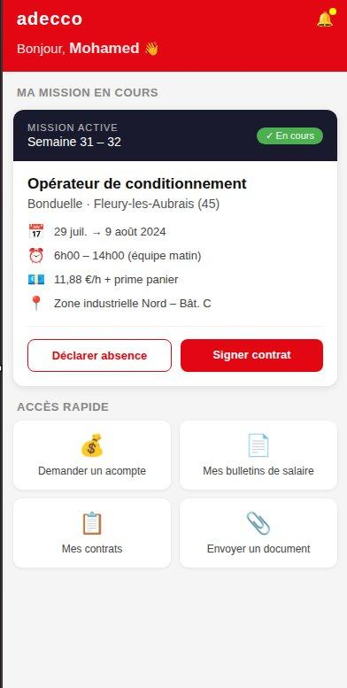

**Ce qui est bien fait :**  
L'accueil salue l'utilisateur par son prénom ("Bonjour, Mohamed 👋"). C'est un détail, mais pour un intérimaire qui utilise beaucoup de plateformes impersonnelles, ça change le ton.  
La carte mission regroupe tout ce dont l'intérimaire a besoin pour sa journée : dates, horaires exacts, taux horaire, adresse du site. Zéro navigation pour trouver "je dois être où à quelle heure".  
Les deux boutons d'action ("Déclarer absence" / "Signer contrat") sont côte à côte, directement sous les infos de la mission. L'action suit logiquement la lecture.  
L'accès rapide en grille 2×2 (acompte, bulletins, contrats, documents) couvre les 4 besoins les plus fréquents d'un intérimaire terrain. Tout est à un tap de l'accueil.  
La bottom navigation à 4 onglets (Accueil, Offres, Missions, Profil) est stable et sobre.

---

## 6. Welcome to the Jungle — Fiche offre enrichie

**Type d'écran :** Détail d'une offre 

**Lien :** [welcometothejungle.com](https://www.welcometothejungle.com/fr/jobs)

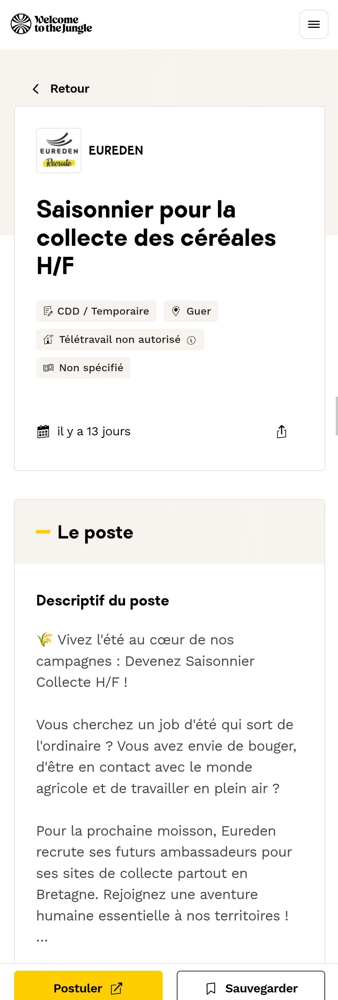

**Ce qui est bien fait :**  
Le logo de l'entreprise et son nom sont en premier — l'identité de l'employeur passe avant le titre du poste. Pour un saisonnier qui choisit autant un lieu qu'un emploi, savoir chez qui on va compter.  
Les tags en pills grises (CDD/Temporaire, lieu, télétravail, salaire) sont tous visibles sans scroller. Un scan de 3 secondes donne les infos clés.  
La description utilise un ton engageant avec des emojis ("🌾 Vivez l'été au cœur de nos campagnes"). Ça parle à quelqu'un qui cherche une aventure, pas juste un bulletin de paie.  
La barre fixe en bas avec "Postuler" (jaune, bien visible) et "Sauvegarder" donne deux choix simples : j'y vais maintenant ou je garde pour plus tard.

---

## 7. Jobagri — Recherche d'offres spécialisée agricole

**Type d'écran :** Recherche filtrée par secteur 

**Lien :** [jobagri.com](https://www.jobagri.com/)

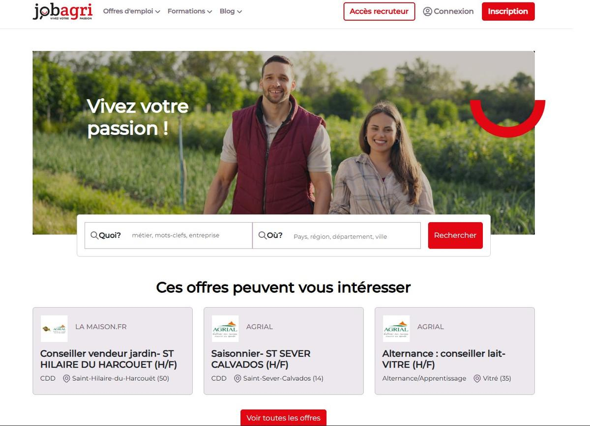

**Ce qui est bien fait :**  
Les onglets par type de contrat (CDI, CDD, Saisonnier, Stage, Alternance) sont affichés horizontalement dès l'écran de recherche. Un saisonnier tape sur son onglet et ne voit que ce qui le concerne.  
Les tags de secteur sont spécialisés et colorés par famille : "Production grande culture" en vert, "Viticulture" en orange, "Agroéquipement" en bleu. Cette granularité parle directement au métier — aucun job board généraliste ne propose ça.  
Le bouton "Postuler" vert est visible directement sur chaque carte, à côté du salaire. Pas besoin d'ouvrir la fiche pour agir.

---

## 8. ANEFA — Carrousel métiers illustrés

**Type d'écran :** Page d'accueil / découverte métiers 

**Lien :** [anefa.org/metiers](https://www.anefa.org/metiers/)

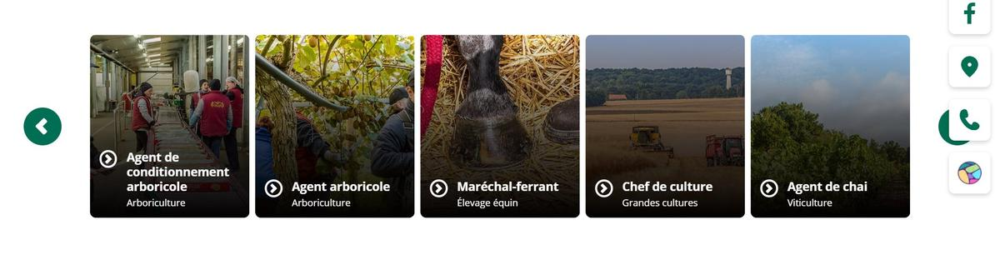

**Ce qui est bien fait :**  
Les métiers sont présentés sous forme de cartes photo plein cadre avec le titre du métier et le secteur en overlay. "Agent de conditionnement arboricole / Arboriculture", "Maréchal-ferrant / Élevage équin" — c'est visuel, concret, et ça montre des vrais gens au travail.  
Le format carrousel horizontal est adapté au scroll mobile au pouce. L'utilisateur découvre les métiers comme il scrolle Instagram — geste naturel, aucun apprentissage nécessaire.  
Chaque carte a un bouton play (▶) qui laisse supposer une vidéo ou fiche détaillée. L'entrée par l'image fonctionne pour quelqu'un qui ne sait pas forcément nommer son métier mais le reconnaît en photo.

---

## 9. Jobopré (ANEFA) — Carte géolocalisée

**Type d'écran :** Écran principal / recherche d'offres   

**Lien :** [anefa.org](https://www.anefa.org/)

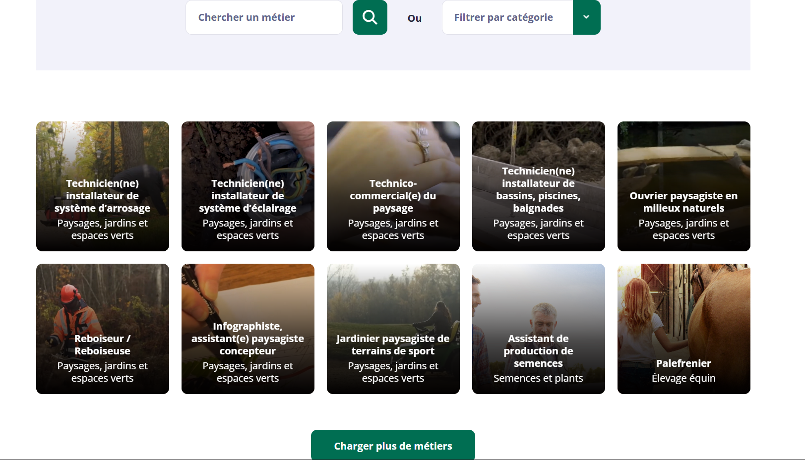

**Ce qui est bien fait :**  
La carte est l'écran principal. Les offres sont représentées par des pictos colorés selon le type de production. L'utilisateur comprend ce qui est disponible autour de lui sans lire.  
Les filtres sont liés au métier : type de culture, hébergement, dates de saison. Aucun filtre générique type "catégorie professionnelle" ou "niveau d'études".  
La fiche offre donne directement le numéro de téléphone de l'exploitant. Pas de messagerie interne — un saisonnier préfère appeler.

---

## 10. L'Agriculture recrute — Accueil national

**Type d'écran :** Page d'accueil candidat 

**Lien :** [lagriculture-recrute.org](https://www.lagriculture-recrute.org/)

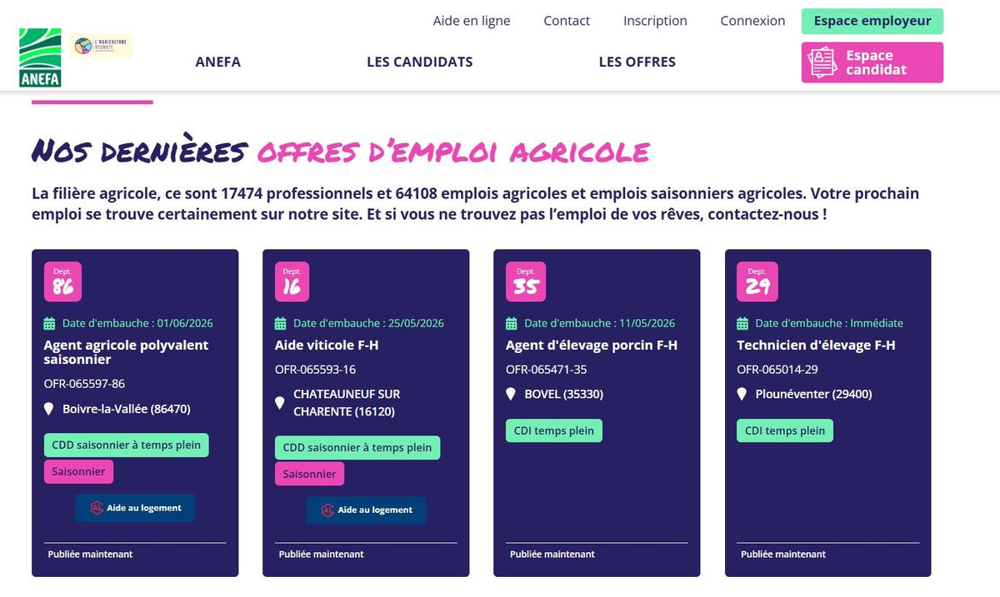

**Ce qui est bien fait :**  
Les chiffres clés sont la première chose visible : "64 047 emplois", "17 450 entreprises", "100+ métiers". Pour quelqu'un qui se demande "est-ce qu'il y a vraiment du travail dans l'agriculture ?", la réponse est immédiate.  
La grille 2×2 (chercher un emploi, déposer mon CV, se former, fiches métiers) couvre les 4 besoins principaux d'un candidat. Pas de menu, pas de sous-pages — tout est à un tap.  
La navigation par région avec compteur d'offres (Nouvelle-Aquitaine : 847, Occitanie : 623…) permet de jauger l'activité dans sa zone en un coup d'œil.

---

## 11. Travaux.com — Formulaire

**Type d'écran :** Formulaire de publication 

**Lien :** [travaux.com](https://www.travaux.com/)

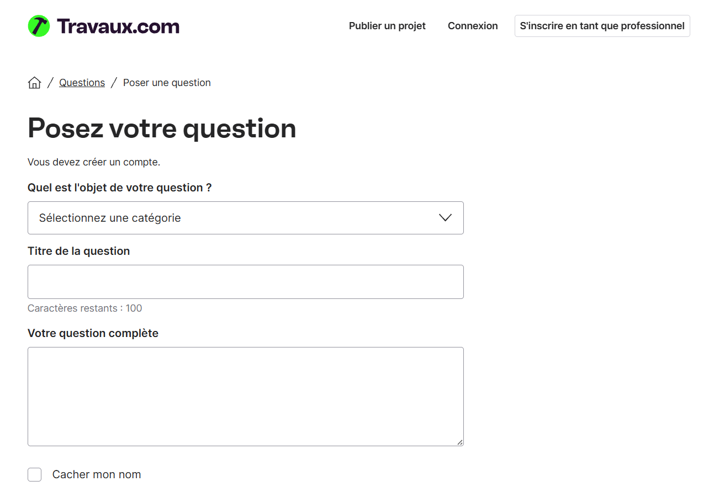

**Ce qui est bien fait :**  
Un champ libre en premier. Avant toute question, l'utilisateur décrit son besoin avec ses mots. Un exploitant qui recherche une personne pour les vendanges n'a pas besoin de trouver la bonne catégorie dans un menu.  
Le délai de réponse est annoncé. Celui qui publie sait ce qui se passe après. Aucun doute, pas d'attente.  
Le formulaire filtre pour les deux côtés. Les questions posées sont celles dont les professionnels ont besoin pour décider s'ils répondent. Un saisonnier qui voit une offre claire sait de suite si l'annonce l'intéresse.

**Type d'écran :** Page d'accueil

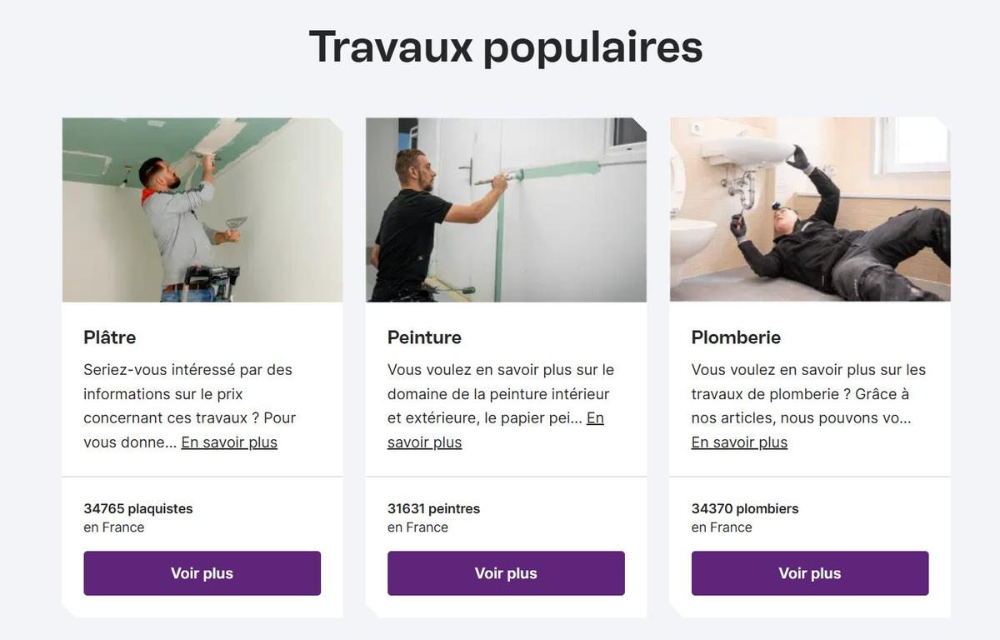

**Ce qui est bien fait :**  
Le compteur de professionnels par métier ("34 765 plaquistes en France", "31 631 peintres") donne immédiatement une preuve sociale. L'utilisateur voit qu'il y a du monde sur la plateforme avant même de poster — ça répond à la question "est-ce que quelqu'un va me répondre ?". C'est le même pattern que StarOfService ("X professionnels proches de chez vous") et L'Agriculture recrute ("64 047 emplois").
L'entrée par le métier illustré plutôt que par une catégorie abstraite. Les cartes montrent des vrais pros au travail avec un titre simple (Plâtre, Peinture, Plomberie). Quelqu'un qui ne connaît pas le nom exact de son besoin le reconnaît en image — même principe que le carrousel ANEFA.

---

## 12. StarOfService

**Type d'écran :** Page d'accueil 

**Lien :** [starofservice.com](https://www.starofservice.com/)

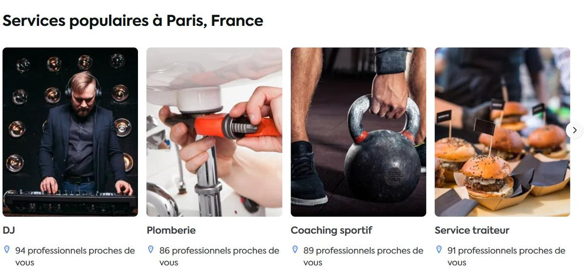
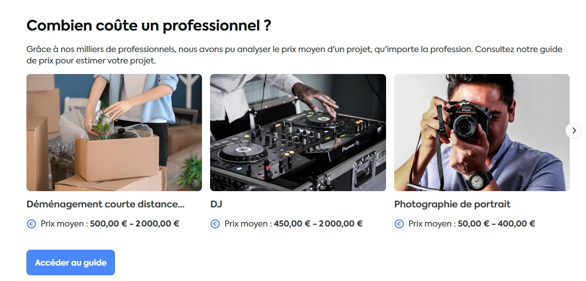

**Ce qui est bien fait :**  
Le flux en 3 étapes illustrées. "Dites-nous tout" → "Comparez les offres" → "Engagez votre professionnel". Trois icônes, trois phrases.  
"X professionnels proches de chez vous" sur chaque catégorie. Réponse immédiate à "est-ce qu'il y a quelqu'un dans mon coin ?".  
Le guide des prix est sur la page d'accueil. Fourchette affichée par métier. Pas de mauvaise surprise, cela donne confiance pour poster.

**Formulaire guidé — qualification du besoin :**

 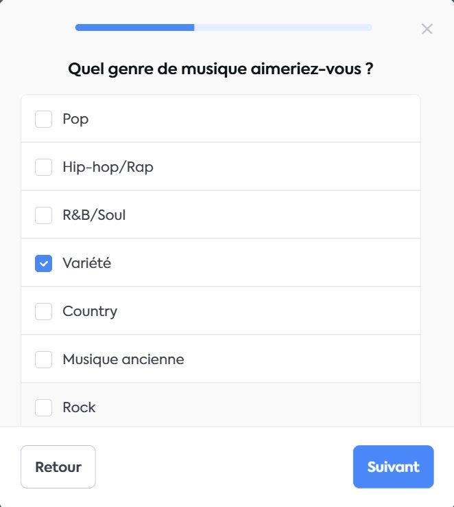 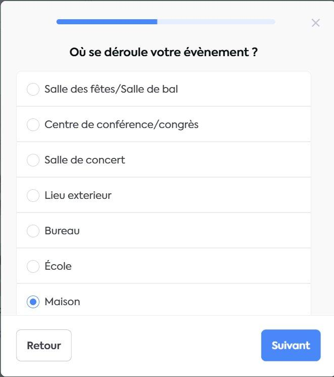 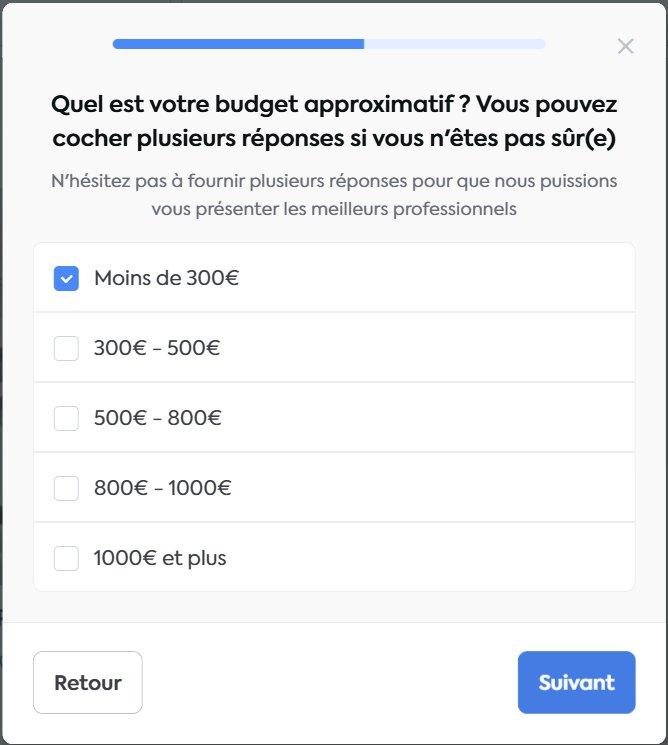 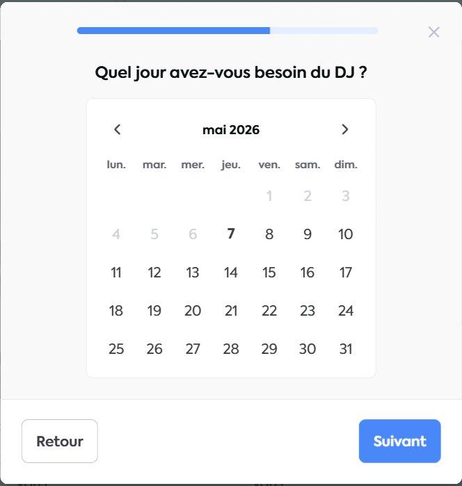

Le formulaire de demande fonctionne comme une conversation : une seule question par écran, une barre de progression en haut, et les boutons "Retour" / "Suivant" toujours au même endroit. Chaque question est formulée en langage courant ("Quel genre de musique aimeriez-vous ?", "Quel jour avez-vous besoin du DJ ?"). L'utilisateur n'a jamais à se demander combien il reste d'étapes ni où cliquer.  
Ce qui est transposable à Project-Labor : ce pattern permet de qualifier un besoin complexe (type de culture, période, hébergement, équipements…) sans présenter un formulaire long et intimidant. Un exploitant qui poste une offre répond à une question à la fois — il n'a pas besoin de tout avoir en tête dès le départ.

---

## 13. WiziFarm

**Type d'écran :** Page contact 

**Lien :** [wizi.farm](https://wizi.farm/)

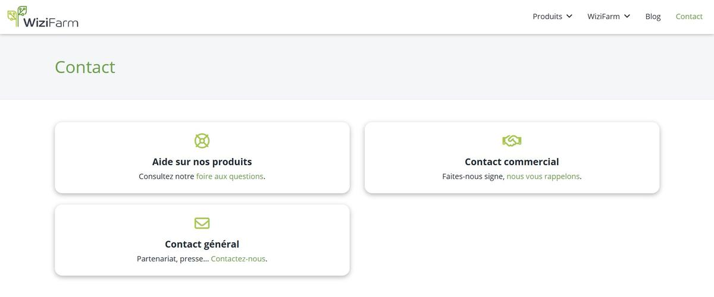

**Ce qui est bien fait :**  
La page contact propose 3 portes, pas un formulaire fourre-tout. FAQ, rappel téléphonique, ou formulaire. L'utilisateur choisit son chemin en une seconde.  
"Nous vous rappelons" plutôt que "Envoyez-nous un message". Le canal par défaut c'est le téléphone, pas l'écrit.  
Chaque produit a un nom simple et une ligne. Mission, Paie'Saisonnier, Petits comptes entre agris — un exploitant comprend en 5 secondes ce qui le concerne.

---

## 14. La Ruche qui dit Oui

**Type d'écran :** Page d'accueil  

**Lien :** [laruchequiditoui.fr](https://laruchequiditoui.fr/fr)

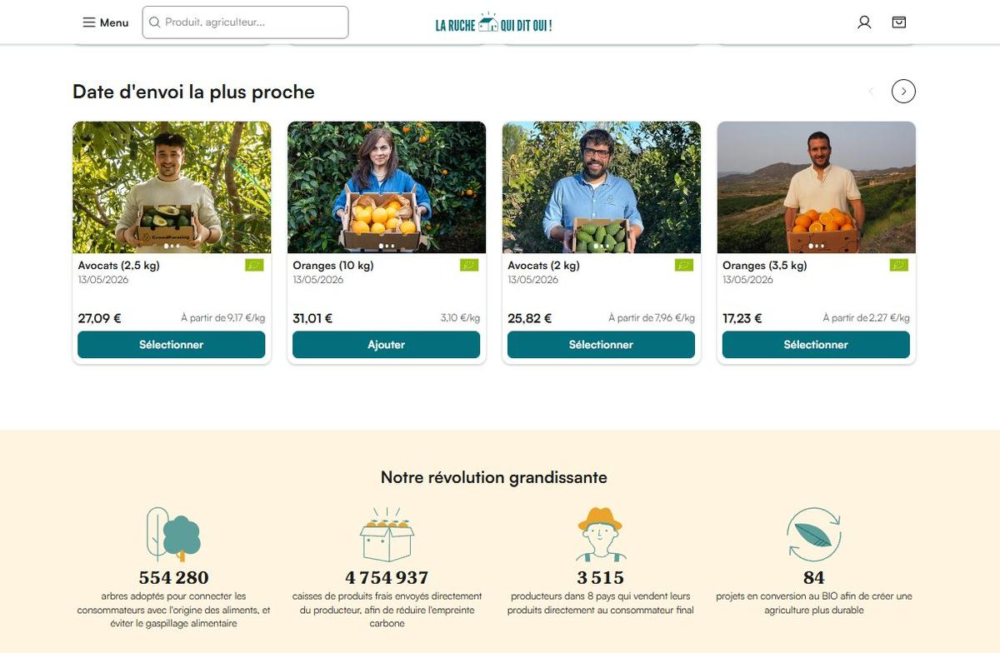

**Ce qui est bien fait :**  
L'entrée par le produit, et non par le menu. L'accueil montre des photos de fruits et légumes en grand format avec un seul bouton ("Commandez une caisse"). Pas de catégories à chercher — on voit ce que l'on peut acheter, on tape dessus. Pour un public terrain, l'image est le menu.  
Les chiffres-clés sont en vitrine. 554 280 arbres adoptés, 4 754 937 caisses envoyées, 3 515 producteurs. La plateforme est "vivante".  
Trois pictogrammes résument l'ensemble. Agriculteur, bio, saison — compréhension aisée.

---

## Synthèse

### Accueil

- Chiffres clés visibles immédiatement — nombre d'offres, d'exploitants, de saisonniers inscrits  
  

- Grille d'accès rapide 2×2 : chercher une offre, publier une offre, mon profil, mes candidatures  
   

- Compteur "X offres" sans avoir lancé de recherche  
  

### Recherche

- Carte géolocalisée comme vue par défaut, avec pictos par type de culture  
  

- Filtres spécialisés métier : type de culture, hébergement, dates de saison — pas de filtres génériques  
   

- Onglets par type de contrat visibles dès l'écran de recherche : CDD, Saisonnier  
  

- Chips de filtres actifs en haut de liste, ajoutables/retirables en un tap  
  

- Infos décisives visibles sur la carte sans ouvrir la fiche : salaire, lieu, type de contrat, date de début  
    

### Détail d'une offre

- Salaire, horaires, lieu empilés verticalement avec icônes  
  

- Bouton "Postuler" fixe en bas d'écran, toujours visible  
    

- Description tronquée avec "Afficher plus" pour ne pas noyer le CTA  
  

- Tags contextuels : logement fourni, panier repas, transport disponible  
   

### Formulaire de publication d'offre

- Champ libre en premier pour décrire le besoin "avec ses mots"  
  

- Une question par écran avec barre de progression  
  

- Choix visuels par icônes pour le type de culture plutôt qu'un menu déroulant  
   

- Photos optionnelles mais emplacements visibles — ça incite sans bloquer  
  

- Délai de réponse estimé affiché pour la réponse  
  

### Formulaire d'inscription / connexion

- Inscription en un formulaire court, opérationnel rapidement  
  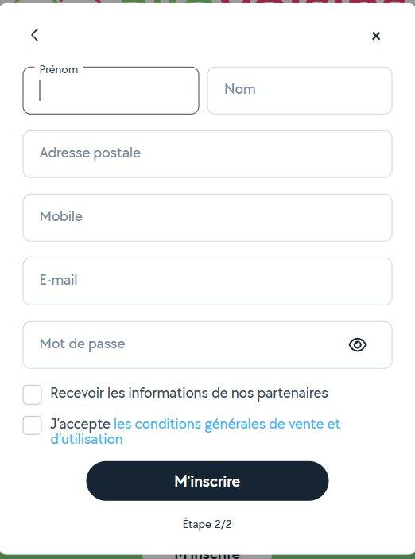 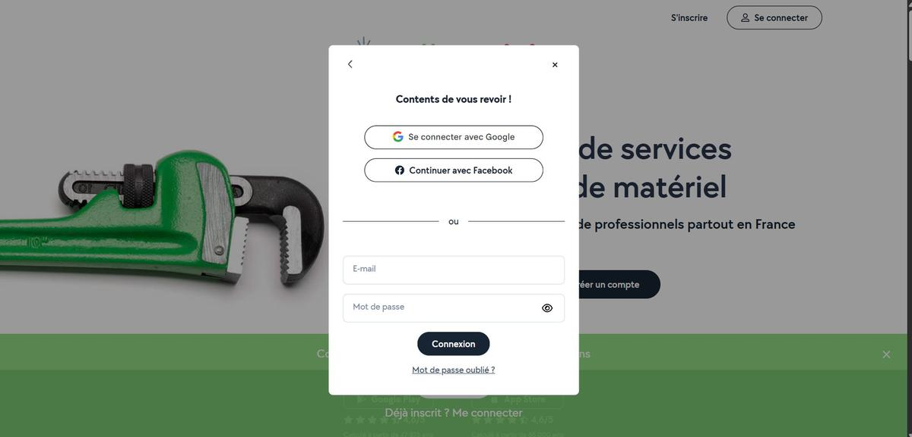

### Dashboard connecté (côté saisonnier)

- Salutation par prénom  
  

- Carte mission avec toutes les infos pratiques regroupées : dates, horaires, lieu, taux horaire  
  

- Accès rapide en grille 2×2 pour les fonctions les plus utilisées  
   

- Profil avec photo, prénom, zone, compétences — pas de CV formel  
  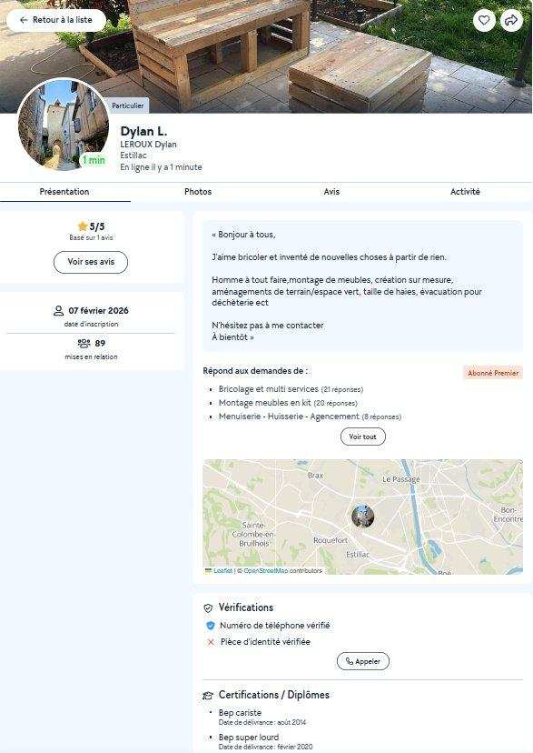

### Dashboard connecté (côté exploitant)

- Notifications actionnables sans ouvrir l'app : 3 lignes d'info + deux boutons  
  

- Les candidatures reçues affichent photo, zone, note — la confiance se construit visuellement  
  

- Profil avec photo, prénom, zone, siret  
  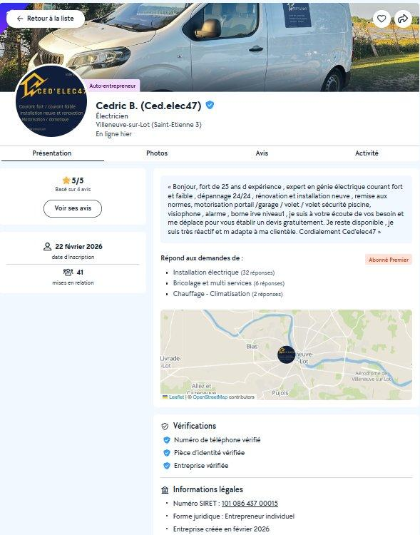

### Navigation

- Bottom navigation à 4 onglets maximum, stable sur tous les écrans  
  

- Carrousel de métiers illustrés par photos de terrain  
  

- Deux entrées séparées demande / offreurs dès la landing page  
  

---

## Idées concrètes applicables à Project-Labor

**1. Prioriser la géolocalisation sur la recherche textuelle.** Le public visé cherche du travail *autour de lui*, pas par mot-clé. Plusieurs plateformes du benchmark (Jobopré, AlloVoisins) montrent que l'entrée spatiale réduit la friction pour des utilisateurs peu à l'aise avec l'écrit.

**2. Rendre l'information décisive visible sans interaction.** Indeed, Hellowork et Jobopré convergent sur le même principe : les 3-4 critères de décision (salaire, lieu, dates, hébergement) doivent être lisibles d'un coup d'œil, sans ouvrir de fiche. Le saisonnier consulte dans des conditions dégradées (soleil, mains occupées, peu de temps) — chaque tap en moins compte.

**3. Parler le langage du métier, pas celui du formulaire.** AlloVoisins et Habitatpresto montrent qu'un champ libre + des pictos métier remplacent avantageusement les menus déroulants et le vocabulaire RH. Pour Project-Labor, ça signifie s'appuyer sur les termes du terrain (vendanges, cueillette, conduite d'engins…) plutôt que sur des catégories administratives.

---
